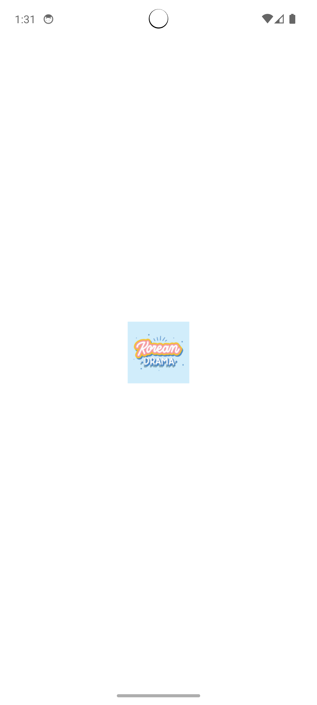
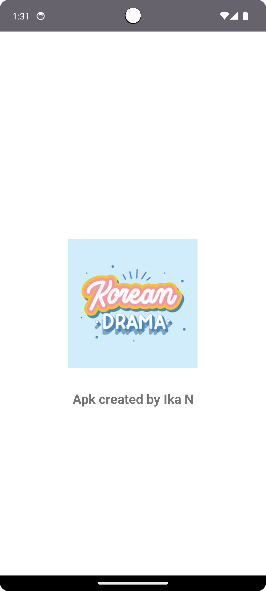
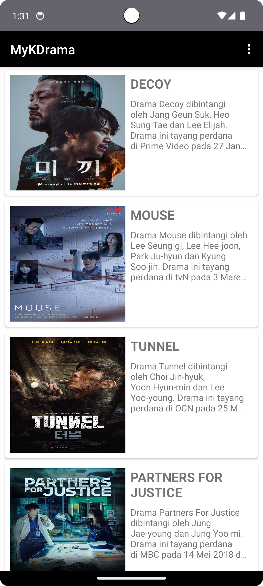
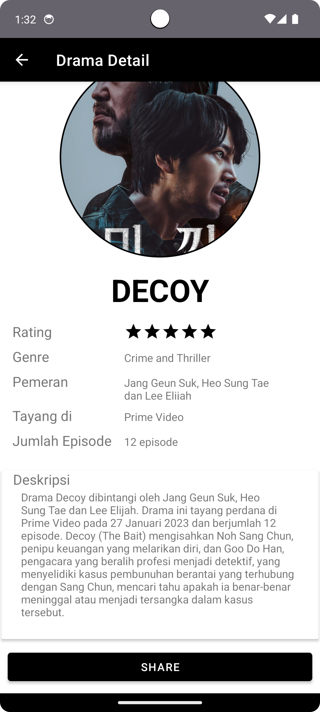
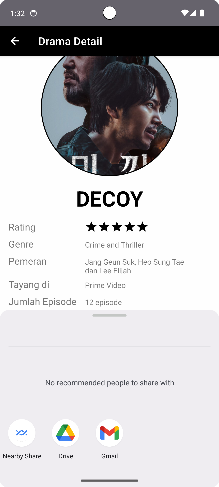
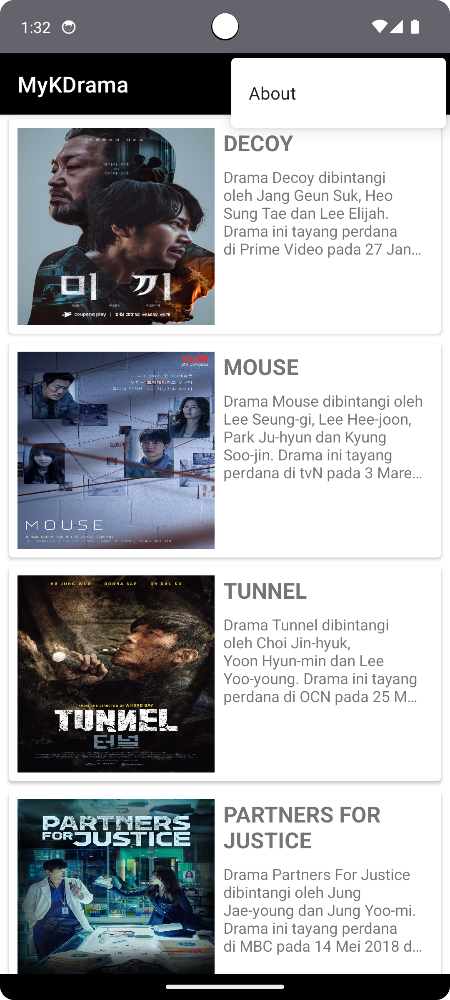

# MyKDrama
Hai, perkenalkan saya Ika Nurfitriani! Repositori ini merupakan hasil submission dari kelas Belajar Membuat Aplikasi Android untuk Pemula. Hasil submission berupa projek aplikasi Android yang diberi nama MyKDrama. Aplikasi ini berguna untuk menampilkan informasi daftar drama.
File `app-debug.apk` : Hasil build dari aplikasi MyKDrama.

# Fitur-Fitur
- SplashScreen: Aplikasi menampilkan logo/gambar dan keterangan pembuat.
- Daftar Drama: Aplikasi menampilkan daftar drama dengan poster, judul dan deskripsi singkat.
- Drama Detail: Aplikasi menampilkan daftar drama dengan rating 5, lalu memberikan informasi mengenai genre, pemeran, informasi tayang, jumlah episode dan deskripsi.
- About: Aplikasi menampilkan informasi dari pembuat yaitu informasi tentang saya.

# Screenshot Aplikasi
Berikut ini adalah hasil screenshot dari aplikasi MyKDrama:

      

## Author
[@Ika Nurfitriani](https://github.com/ikanurfitriani)